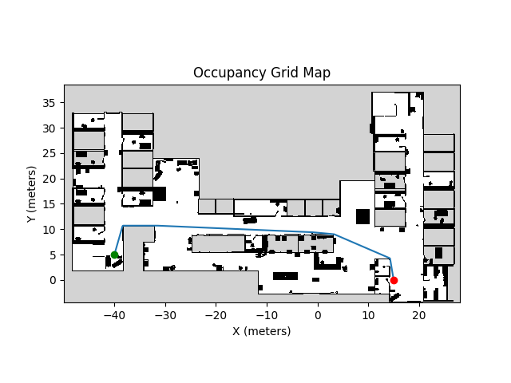

# Python 2D Global Path Planners

## Implemented Algorithms

### RRT-unicycle
Until goal is reached or max_iter is reached:
1. Sample a random point (x, y).
2. Find the nearest node (by position) in the tree to the random point.
3. Drive from the nearest node towards the random point and get new node position.
4. Check collision and reachability.
    - If collision or unreachable, continue.
5. Add the new node to the tree with the parent node.
    - The heading of the new node is assigned by the path from the parent node chosen for that node.

NOTE: When connectin $p_\text{new}$ to the existing node, agent does not perform self pivot to reduce path completion time.

### RRT* Smooth Unicycle
For unicycle robot.

<p align="center">
  
  
  <figcaption align="center">Fig. 1: RRT*-SmoothUnicycle tree and path with path length as a cost.</figcaption>
</p>


1. Sample a random point (x, y).
2. Find the nearest node (by position) in the tree to the random point.
3. Drive from the nearest node towards the random point and get new node position.
4. Find the nodes withing near_node_threshold distance from the new node position.
5. Choose the parent node with minimum cost from the near nodes.
    - For each near node:
        - Get arc path from the near node to the new node.
        - Check collision and calculate the cost of the path.
6. Add the new node to the tree with the parent node.
    - The heading of the new node is assigned by the path from the parent node chosen for that node.
7. Rewire the tree.
    - To check if two pose can be connected, try connecting poses only using the two arc.
    - If the pose connecting two arc (the intersection pose) is within dist_near from both poses, they can be rewired.
    - If rewired, the pose connecting two arcs is also added as a node.

### RRT* Smooth Unicycle +

1. Try in-place pivot only in the start node.
2. ~~When finding near nodes, nodes added in the rewiring steps are ignored.~~ :Not implemented

#### Difference from [RRT*-unicycle](https://github.com/naokiyokoyama/rrt_star) (Yokoyama, 2023)
- Robot does not pivot.
- In rewiring step, dubins path is used. 
    TODO: add graceful control (park, 2011)

### A*
Implementation of A* algorithm.

### A*-bending
Plans shortest path with minimum bending.
Cost: dist + 1(bending)

### [Theta*](https://arxiv.org/abs/1401.3843)
Implementation of Theta* algorithm.
LineOfSight function is implemented using supercover [Bresenham-based supercover line algorithm](http://eugen.dedu.free.fr/projects/bresenham/).


<p align="center">
  
  
  
  <figcaption align="center">Fig. 2: A* planner path (left), Theta* planner path (middle) and A* bending planner path(right).</figcaption>
</p>


## Get started
1. Setup env using Conda.
    ```bash
    conda env create --file environment.yml
    conda activate pgpp
    ```
2. Run examples
    ```bash
    python examples/4_theta_star.py
    ```

## How to run tests.
```bash
bash run_tests.sh
```

# TODO
Rename check_unicycle_reachability -> check_unicycle_pos_reachability
# References
1. [N. Yokoyama, S. Ha, and D. Batra, “Success weighted by completion time: A dynamics-aware evaluation criteria for embodied navigation,” in IROS, 2021.](https://arxiv.org/abs/2103.08022)
2. [K. Daniel, A. Nash, S. Koenig, and A. Felner, “Theta*: Any-angle path planning on grids,” Journal of Artificial Intelligence Research, vol. 39, pp. 533–579, 2010.](https://arxiv.org/abs/1401.3843)
3. [D. Eugen, "Bresenham-based supercover line algorithm", http://eugen.dedu.free.fr/projects/bresenham/, 2001](http://eugen.dedu.free.fr/projects/bresenham/)
